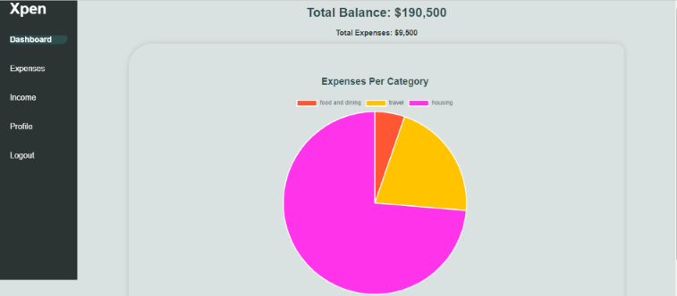

# Xpen- An Expense Tracker App




## Introduction

*Empower yourself to take control of your finances with our user-friendly app. Easily record expenses and income, categorize transactions, and gain valuable insights through detailed reports. Whether you're a student on a budget or a working professional, manage your finances effortlessly.*

 Irene Muthoni - [LinkedIn](https://www.linkedin.com/in/irene-n-9b6828210)

Wanjiru Charity - [LinkedIn](https://www.linkedin.com/in/wanjiru-charity-6a6b821ab)

Vincent Obaro - [LinkedIn](https://www.linkedin.com/in/vincelogs)
## Installation

### Prerequisites

- Node.js
- npm
- http-server

### Installation Steps

1. Clone the repository:

   ```bash
   git clone https://github.com/Vincelogs/Xpen.git
   ```
2. Navigate to the project folder:
   ```
   cd Xpen
   ```

## Usage

### Quick Start

To get started with our project, follow these simple steps:

1. Install the project as described in the [Installation](#installation) section.

2. Run the following command to start the application:

   ```bash
   http-server
   ```
3. Access the application in your web browser at   http://127.0.0.1:8080


## Contributing

We welcome contributions to our project.
### How to Contribute
* Fork the repository to your GitHub account
* Create a new branch for your feature or bug fix
* Make your changes and ensure that tests pass
* Push the new branch with the feature or bug fix
* Submit a pull request with a clear description of  your changes and reference the related issue, if applicable.


## Related projects

Here are some related projects

[Expense.fyi](https://github.com/gokulkrishh/expense.fyi)

[budget-tracker](https://github.com/sammitjain/budget-tracker)

[telegram-expense-bot](https://github.com/muety/telegram-expense-bot)


## Licensing

This project is currently in development, and we haven't yet finalized the licensing terms. We kindly ask you to refrain from copying, or distributing it until we've determined the appropriate license.

Stay tuned for updates regarding the project's licensing status. In the meantime, feel free to explore the code and contribute to its development.

Thank you for your understanding and patience.
